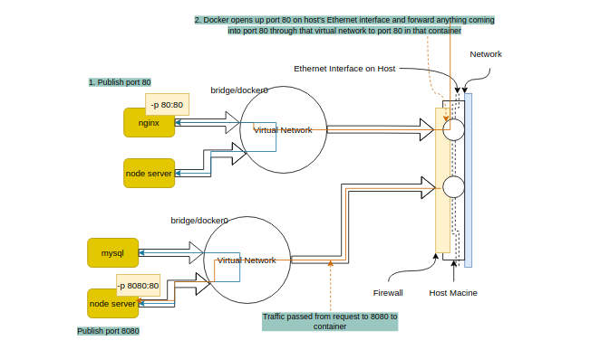

# learning-docker
Learning Docker

## Starting Docker
```sh
sudo systelctl start docker
docker version
docker info
```

## Running a container
```sh
docker container run --publish 80:80 --detach --name nginx_container nginx:alpine
docker container logs nginx_container
docker container stop nginx_container
docker container rm c1 c2 c3 --force
```

## Docker Internals
https://www.youtube.com/watch?v=sK5i-N34im8&list=PLBmVKD7o3L8v7Kl_XXh3KaJl9Qw2lyuFl

## Container is just a process
```sh
# listing the processes in the container
[be@fedora ~]$ docker container top nginx
UID        PID         PPID       C     STIME     TTY    TIME       CMD
root       64714       64693      0     18:11     ?      00:00:00   nginx: master process nginx -g daemon off;
101        64767       64714      0     18:11     ?      00:00:00   nginx: worker process
101        64768       64714      0     18:11     ?      00:00:00   nginx: worker process
101        64769       64714      0     18:11     ?      00:00:00   nginx: worker process
101        64770       64714      0     18:11     ?      00:00:00   nginx: worker process

# listing the processes in the host
[be@fedora ~]$ ps -ef | grep nginx
root       64714   64693          0     18:11     ?      00:00:00   nginx: master process nginx -g daemon off;
101        64767   64714          0     18:11     ?      00:00:00   nginx: worker process
101        64768   64714          0     18:11     ?      00:00:00   nginx: worker process
101        64769   64714          0     18:11     ?      00:00:00   nginx: worker process
101        64770   64714          0     18:11     ?      00:00:00   nginx: worker process
be         64813   63497          0     18:12     pts/1  00:00:00   grep --color=auto nginx

# stop the container
[be@fedora ~]$ docker container stop nginx

# check again
[be@fedora ~]$ ps -ef | grep nginx
be         65123   63497          0     18:18     pts/1  00:00:00   grep --color=auto nginx
```

## Checking what's going on inside a container
docker container top - process list in one container
docker container inspect - details of one container config
docker container stats - performance stats for all containers

## Getting a shell inside container
```sh
# at start time
docker container run -it image sh
# after statring
docker container exec -it contaienr sh
```

## Docker networks
See which ports are open on a container:
docker container port container

- Each container connected to a private virtual network "bridge"
- Each virtual network routes through NAT firewall on host IP
- All containers on a virtual network can talk to each other without -p
- Best practive is to create a ne virtual network for each app: Ex:

    - network "my_web_app" for mysql and php/apache containers
    - network "my_api" for mongo and nodejs containers

- We can attach one container to many networks
- Skip virtual networks and use host IP --net=host 

    Ex:

    ```sh
    docker container run -d --net=host nginx:alpine
    ```
    and then go to http://localhost and we will get nginx homepage; because nginx container is connected to the host network/ip.

- We can use different Docker network drivers to gain more abilities.

#### A sample usecase of how Docker networks work..

Suppose out host operating system is connected to a network (say ethernet) through Ethernet interface. There's a little firewall which blocks all incoming traffic from the network so that everything is blocked by default. Any traffic that's coming out from my containers is going to be NATed by default. It's acting like a pretty common edge firewall on a network.



There's this concept of the virtual networks, and by default, you'll see a network called bridge or docker0. When you start a new container, say nginx, that container is attached to that network and that virtual network is automatically attached to your Ethernet interface on your host so that it can get out. In our case, when we just launched that Nginx, we gave it a -p 80:80. Docker managed to open up port 80 on our Ethernet interface on our host and forward anything coming into port 80 through that virtual network to port 80 in that container. By default, when we create a second container, it's put on that same bridge network. Those two containers can talk freely back and forth on their exposed ports. Unless we specify the -p, no traffic coming into our internal networks is going to get to our containers. 

We can't have two containers listening on the port 80 at the host level. Only one can do that. If you try to start another container, it would actually error out and say that there's already something else on that port. That's not a Docker limitation; that's just a limitation of how IP networking typically works.


### Using the CLI
#### Show networks
`docker network ls`
```sh
[be@fedora ~]$ docker network ls
NETWORK ID     NAME      DRIVER    SCOPE
bb5def3f463d   bridge    bridge    local
bd329c0586ea   host      host      local
9ab44717d5ee   none      null      local

```
| network name | | |
| --- | --- | --- |
| bridge | Default Docker virtual network which is NATed behing the host IP | `--network bridge` |
| host | The network of host. It gains performance by skipping virtual networks but sactifices security of container model | `--network host` |
| none | Removes eth0 and only leaves us with localhost interface in container | `--network none` |

#### Inspect a network
`docker network inspect [network name | network id]`

#### Create a network
`docker network create --driver` - this spawns a new virtual network for us to attach containers to.
```sh
[be@fedora ~]$ docker network create my_app_net
c9e21eab7cc13bbc335ec9b73505569ffea5a8a6e76a86a54c72701ebb484ba6
[be@fedora ~]$ docker network ls
NETWORK ID     NAME         DRIVER    SCOPE
bb5def3f463d   bridge       bridge    local
bd329c0586ea   host         host      local
c9e21eab7cc1   my_app_net   bridge    local 👈 # the default driver is 'bridge'
9ab44717d5ee   none         null      local
```
We can specify more advanced options with the create command. Check out `docker netork create --help`.

While creating a new container, we can specify the network using the --network flag.
```
[be@fedora ~]$ docker run --name nginx -d --network my_app_net nginx:alpine
388af12d076a3586bc12845eb02df0cd649c3844bbd78a1810080fb595636f8a
[be@fedora ~]$ docker network inspect my_app_net | grep "Containers" -A 7
        "Containers": {
            "388af12d076a3586bc12845eb02df0cd649c3844bbd78a1810080fb595636f8a": {
                "Name": "nginx",
                "EndpointID": "f397b5b74d1dbb1167660cbfd0089170ac70d8caf2425102d2de7206b85396fd",
                "MacAddress": "02:42:ac:19:00:02",
                "IPv4Address": "172.25.0.2/16",
                "IPv6Address": ""
            }
[be@fedora ~]$ 
```

#### Add a container to a network
`docker network connect <network> <container>`
```
[be@fedora ~]$ docker run -d --name redis redis:alpine
e6c896a1755e9ec4e620418f5b3b4f70505fe9e6953dc425eb6e465303211f38
[be@fedora ~]$ docker network connect my_app_net redis
[be@fedora ~]$ docker network inspect my_app_net | grep "Containers" -A 14
        "Containers": {
            "388af12d076a3586bc12845eb02df0cd649c3844bbd78a1810080fb595636f8a": {
                "Name": "nginx",
                # ...
                "IPv4Address": "172.25.0.2/16",
                "IPv6Address": ""
            },
            "e6c896a1755e9ec4e620418f5b3b4f70505fe9e6953dc425eb6e465303211f38": {
                "Name": "redis",
                # ...
                "IPv4Address": "172.25.0.3/16",
                "IPv6Address": ""
            }
[be@fedora ~]$ 
```


#### Detach a container from a network
`docker network disconnect <network> <container>`

### DNS and How Containers find each other
DNS Basics:
- Comic Version https://howdns.works/

It's a bad idea to use staic ip addresses for internal communications; instead use hostnames. Docker deamon has an in-built DNS server that contains use by default and they use container names as an equivalent of hostnames for containers to talk to each other. 

Docker defaults the hostname to the container's name, but we can also get aliases.

```sh
[be@fedora Desktop]$ docker container run --network my_app_net -d --name nginx1 nginx:alpine]
[be@fedora Desktop]$ docker container run --network my_app_net -d --name nginx2 nginx:alpine]

# now if we inspect the network 'my_app_net', it will have to containers
# and as we mentioned, they will be automatically DNS resolved.

# ping the nginx2 from nginx1
[be@fedora Desktop]$ docker container exec -it nginx1 ping nginx2
PING nginx2 (172.25.0.3): 56 data bytes
64 bytes from 172.25.0.3: seq=0 ttl=64 time=0.110 ms
64 bytes from 172.25.0.3: seq=1 ttl=64 time=0.264 ms
^C
--- nginx2 ping statistics ---
2 packets transmitted, 2 packets received, 0% packet loss
round-trip min/avg/max = 0.110/0.187/0.264 ms
# ping the nginx1 from nginx2
[be@fedora Desktop]$ docker container exec -it nginx2 ping nginx1
PING nginx1 (172.25.0.2): 56 data bytes
64 bytes from 172.25.0.2: seq=0 ttl=64 time=0.084 ms
64 bytes from 172.25.0.2: seq=1 ttl=64 time=0.265 ms
64 bytes from 172.25.0.2: seq=2 ttl=64 time=0.299 ms
^C
--- nginx1 ping statistics ---
3 packets transmitted, 3 packets received, 0% packet loss
round-trip min/avg/max = 0.084/0.216/0.299 ms
```

> So, the catch here is: containers can't really, or shouldn't really, rely on IP addresses for talking to each other because they just can't be relied on. And that DNS is really the standard here for how we do intercommunication between containers on the same host and across hosts.