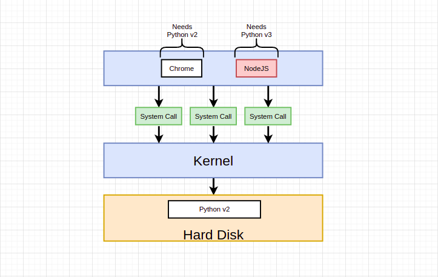

# learning-docker
Learning Docker

NoteBeforeStart: Through the entire note, I am using Fedora. Therefore all commands used in the note will for the same distro.

# 1. Installation
#### Install Docker
https://docs.docker.com/engine/install/

#### Login to the Dockerhub
In order to push and pull images, you will need to login to the Dockerhub. In your terminal, run docker login and then enter your Dockerhub account's username and password.

#### Run without Sudo
Follow these instructions to run Docker commands without sudo: https://docs.docker.com/install/linux/linux-postinstall/#manage-docker-as-a-non-root-user

#### Start on Boot
Follow these instructions so that Docker and its services start automatically on boot: https://docs.docker.com/install/linux/linux-postinstall/#configure-docker-to-start-on-boot

# 2. Getting Started
### `docker run`
```sh
docker run hello-world
```
What happens under the hood when `docker run` is executed?


Docker CLI checks the local cache/image cache if the mentioned image is present on local system or not. If now, it will fetch the image from Docker Hub and start the contianer.

## What is a Container?
Most operating systems have something called a kernel. The kernel is a running software process that governs access between all the programs that are running on your computer and all the physical hardware that is connected to your computer as well. So if you're at the top of this diagram we have different programs that your computer's running such as chrome or terminal Spotfire note. If you've ever made use of Nogay as before and you've written a file to the hard drive it's technically not NodeJS that is speaking directly to the physical device instead. NodeJS says to your kernel hey I want to write a file to the hard drive. The kernel then takes that information and eventually persists it to the hard disk. So the kernel is always kind of this intermediate layer that governs access between these programs in your actual hard drive. 


The other important thing to understand here is that these running programs interact with the kernel through things called system calls. These are essentially like function invocations. The kernel exposes different end points to say hey if you want to write a file to the hard drive call this endpoint or this function right here it takes some amount of information and then that information will be eventually written to the hard disk or memory or whatever else is required. 

Now thinking about this entire system right here I want to pose a kind of hypothetical situation to you. I want you to imagine for just a second that you and I have two programs running on our computer. 



Maybe one of them is chrome and the other is NodeJS - the javascript server side runtime. I want you to imagine that we're in a crazy world where Chrome in order to work properly has to have Python version 2 installed and NodeJS has to have version 3 installed. However on our hard disk we only have access to Python version 2 and for whatever crazy reason we are not allowed to have two identical installations of Python at the same time. So as it stands right now Chrome would work properly because it has access to version 2 but NodeJS would not because we do not have a version or a copy of Python version 3.

So how can we solve this issue? Well one way to do it would be used to make use of a operating system feature known as **name spacing**. With name spacing. We can look at all of the different hardware resources connected to our computer and we can essentially segment out portions of those resources. So we could create a segment of our hard disk specifically dedicated to housing Python version 2. And we could make a second segment specifically dedicated to housing Python version 3.


Then to make sure that Chrome has access to this segment over here and no US has access to this segment over here any time that either them issues a system call to read information off the hard drive the kernel will look at that incoming system call and try to figure out which process it is coming from. So the kernel could say okay if Chrome is trying to read some information off the hard drive I'm going to direct that call over to this little segment of the hard disk over here. The segment that has Python version 2 and NodeJS, any time that makes the system call the read the hard drive the kernel can redirect that over to this segment for Python version 3. And so by making use of this kind of name spacing we're segmenting feature, we can have the ability to make sure that Chrome and node us are able to work on the same machine. 

Now again in reality neither of these actually needed installation of Python. This is just a quick example. 

So **this entire process of kind of segmenting a hardware resource based on the process that is asking for it is known as name spacing**. 


With name spacing we are allowed to isolate resources per a process or a group of processes and we essentially saying that any time a particular process asks for a resource we're going to direct it to this one little specific area of the given piece of hardware. Now name spacing is not only used for hardware it can be also used for software elements as well. So for example we can namespace a process to restrict the area of a hard drive that is available or the network devices that are available or the ability to talk to other processes or the ability to see other processes. These are all things that we can use named spacing for to essentially limit the resources we're kind of redirect requests for resource from a particular process very closely related to this idea of some name spacing is another feature called control groups. **A control group can be used to limit the amount of resources that a particular process can use**. So name spacing is for saying hey this area of the harddrive is for this process. A control group can be used to limit the amount of memory that a process can use, the amount of CPU the amount of hard drive, the input output and the amount of network bandwidth. **So these two features put together it can be used to really kind of isolate a single process and limit the amount of resources it can talk to and the amount of bandwidth essentially that it can make use of**. 


Now as you might imagine **this entire kind of little section right here this entire vertical of a running process plus this little segment of resource that it can talk to is what we refer to as a container**. And so when people say oh yeah I have a container, you really should not think of these as being like a physical construct that exists inside of your computer. Instead **a container is really a process or a set of processes that have a grouping of resources specifically assigned to it**. 


And so this is a diagram that we're going to be looking at quite a bit Any time that we think about a container. We've got some running process that sends a system call to a kernel. The kernel is going to look at that incoming system call and direct it to a very specific portion of the hard drive the RAM CPI or whatever else it might need. And of a portion of each of these resources is made available to that singular process. 

#### How is that single file eventually create this container? 
Any time that we talk about an image we're really talking about a file system snapshot. So this is essentially kind of like a copy paste of a very specific set of directories or files. And so we might have an image that contains just chrome and Python an image will also contain a specific startup command. 


So here's what happens behind the scenes when we take an image and turn it into a container. First off the kernel is going to isolate a little section of the harddrive and make it available to just this container. And so we can kind of imagine that after that little subset is created the file snapshot inside the image is taken and placed into that little segment of the harddrive. And so now inside of this very specific grouping of resources we've got a little section of the harddrive that has just chrome and Python installed and essentially nothing else. 

The startup command is then executed which we can kind of imagine like `startup chrome`. And so Chrome is invoked. We create a new instance of that process and that created process is then isolated to this set of resources inside the container. So that's pretty much it. That is the relationship between a container and an image and it's how an image is eventually taken and turn into a running container.

# 3. Manipulating Containers with Docker Client
## 3.1 Run an Image/Start a Container - `docker run`
```
docker run IMAGE
```
### Over ride default start up command
```
docker run IMAGE [COMMAND]
```
Example:
```sh
docker run busybox ls
# user@mC:~/Desktop$ docker run busybox ls
# bin
# dev
# etc
# home
# proc
# root
# sys
# tmp
# usr
# var
```
**What is actually happening!?** 

In fact these are folders that are being printed out that are not belonging to you on your computer. These are folders that exist solely inside that container. 


Over here we've got the busy box image. It has some default file system snapshot and some presumedly default command. It has this default file system snapshot with default folders of `bin`, `dev`, `home`, `proc`, `root` and so on all the ones you see listed right here. So when we create a new container out of that image we take this file system snapshot we stick it in as the folder for that container and then the command that we execute is `ls`. So we list out all the files and folders inside of our harddrive.

**The startup commands that we are executing are being based upon the file system include with the image**. And if we try to execute a command inside the container that uses a program that doesn't or is not contained within this file system we will get an error..

## 3.2 Listing Running Containers - `docker ps`
```
docker ps [OPTIONS]
Options:
 -a, --all    Show all containers (default shows just running)
 -f, --filter filter Filter output based on conditions provided
  --format string Pretty-print containers using a Go template
 -n, --last int  Show n last created containers (includes all states) (default -1)
 -l, --latest   Show the latest created container (includes all states)
  --no-trunc  Don't truncate output
 -q, --quiet   Only display container IDs
 -s, --size   Display total file sizes

```
Example: List all the containers which were created

## 3.3 Container LifeCycle
### Running a Container
We have seen `docker run` command. Actually this is a combination of two commands :
```
docker run IMAGE = docker create IMAGE + docker start CONTIANER
```
Creating a container is where we kind of take the file system and put it for use in the new container(refresh of container structure [here](#How-is-that-single-file-eventually-create-this-container?)). The command to actually start the container is `docker start`. That's when we actually execute the startup command that might start up the process of like hello world or in the case of that busy box one that we used the `ls` or whatever process is supposed to be executed inside the container. So again creating a container is about the file system and starting is about actually executing the startup command.

Example:
```sh
# create a container
docker create hello-world
# b32eab598287aa7ba6a2cf4cd96fe0e42a355d80aa33970802cd4e379cab7e42 - id of the container created


# execute command inside this container
docker start -a b32eab598287aa7ba6a2cf4cd96fe0e42a355d80aa33970802cd4e379cab7e42
# on running this, we will get that familiar welcome message
```
What does `-a` do? That option, make docker actually watch for output from the container and print it out to your terminal. Check the `docker start` man.
``` 
Usage: docker start [OPTIONS] CONTAINER [CONTAINER...]

Start one or more stopped containers

Options:
 -a, --attach    Attach STDOUT/STDERR and forward signals
  --detach-keys string Override the key sequence for detaching a container
 -i, --interactive   Attach container's STDIN
```

### Stopping Containers
Stop one or more running containers:
```
docker stop [OPTIONS] CONTAINER [CONTAINER...]

Options:
 -t, --time int Seconds to wait for stop before killing it (default 10)
```
Kill one or more running containers:
```
docker kill [OPTIONS] CONTAINER [CONTAINER...]

Kill one or more running containers

Options:
 -s, --signal string Signal to send to the container (default "KILL")
```

**What is the difference between `docker stop` and `docker kill`?**

Well here's what happens behind the scenes when you issue a docker stop command. A hardware signal is sent to the process. We send a `SIGTERM` message which is short for terminate signal it's a message that's going to be received by the process telling it essentially to shut down on its own time. 


`SIGTERM` is used any time that you want to stop a process inside of your container and shut the container down. And you want to give that process inside there a little bit of time to shut itself down and do a little bit of cleanup. A lot of different programming languages have the ability for you to listen for these signals inside of your codebase. And as soon as you get that signal you could attempt to do a little bit of cleanup or maybe save some file or emit some message or something like that. 

On the other hand the docker kill command issues a `SIGKILL` or kill signal to the primary running process inside the container. It essentially means you have to shut down right now and you do not get to do any additional work. So ideally we always stop a container with the Dockers stop command in order to get the running process inside of it a little bit of time to shut itself down. Otherwise if it feels like the container has locked up and it's not responding to the docker stop command then we could issue a dock or kill instead. Now one kind of little oddity or interesting thing about Docker stop when you issued dock or stop to a container if the container does not automatically stop in 10 seconds then Dockers going to automatically fall back to issuing the docker kill command. So essentially Dockers stop is us being nice but it it's only got 10 seconds to actually shut down.

### Restarting a Stopped Container
Suppose there is an exited/stopped container:
```sh
docker ps -a
# b32eab598287 hello-world "/hello" 17 minutes ago Exited (0) 15 minutes ago    confident_ishizaka
```
We can start this again using the same `start` command:
```
docker start [-a] CONTAINER
 -a, --attach    Attach STDOUT/STDERR and forward signals
```

### Removing a Stopped Container
To remove all stopped containers you can use:
```
docker system prune [OPTIONS]

Options:
 -a, --all    Remove all unused images not just dangling ones
  --filter filter Provide filter values (e.g. 'label=<key>=<value>')
 -f, --force   Do not prompt for confirmation
  --volumes   Prune volumes
```
WARNING! This will remove:
 - all stopped containers
 - all networks not used by at least one container
 - all dangling images
 - all dangling build cache

You can remove one or more containers using it's container id or name using `docker rm`
```
docker rm [OPTIONS] CONTAINER [CONTAINER...]

Options:
 -f, --force  Force the removal of a running container (uses SIGKILL)
 -l, --link  Remove the specified link
 -v, --volumes Remove anonymous volumes associated with the container
```

### Retrieving Log Outputs
```
docker logs [OPTIONS] CONTAINER

Options:
  --details  Show extra details provided to logs
 -f, --follow   Follow log output
  --since string Show logs since timestamp (e.g. 2013-01-02T13:23:37Z) or relative
      (e.g. 42m for 42 minutes)
 -n, --tail string Number of lines to show from the end of the logs (default "all")
 -t, --timestamps  Show timestamps
  --until string Show logs before a timestamp (e.g. 2013-01-02T13:23:37Z) or relative
      (e.g. 42m for 42 minutes)
```

### Executing commands in Running Containers
```
docker exec -it <container id> <command>
 -i, --interactive   Keep STDIN open even if not attached
 -t, --tty     Allocate a pseudo-TTY
```

##### What does `it` do?

As a quick reminder, when you are running docker on your machine, every single container that you are running is running inside of a virtual machine running Linux. In this diagram, we've got three different running processes all inside in theory of a running container or really inside of a Linux environment.


Every process that we create in a Linux environment has three communication channels attached to it that we refer to as standard in, standard out and standard error. These channels are used to communicate information either into the process or out of the process. Standard in is used to communicate information into the process. So when you're at your terminal and you type stuff in the stuff, you type is being directed into a running standard and channel attached to the process. The standard out channel that is attached to any given process is going to convey information that is coming from the process. So standard out might be redirected over to your running terminal and that's going to end up as being stuff that is going to show up on the screen. Standard Error is very similar, but it conveys information out of the process that is kind of like an error in nature. 

By adding on the `-i` flag, we are saying make sure that any stuff that we type gets directed to standard input stream of the running process. `-t` is used to make sure that the output coming from the standard output and error are nicely formatted and displayed.

### Starting with a Shell
```
docker run -it redis-cli sh
```

# 4. Docker Internals
To know more about how Docker is built and what's happening inside Docker system, watch the video:
https://www.youtube.com/watch?v=sK5i-N34im8&list=PLBmVKD7o3L8v7Kl_XXh3KaJl9Qw2lyuFl

### Container is just a process
What ever is happening inside a container is actually happening on the host machine and a container is just an abstraction over various processes. See an example below:
```sh
# listing the processes in the container
[be@fedora]$ docker container top nginx
UID        PID         PPID       C     STIME     TTY    TIME       CMD
root       64714       64693      0     18:11     ?      00:00:00   nginx: master process nginx -g daemon off;
101        64767       64714      0     18:11     ?      00:00:00   nginx: worker process
101        64768       64714      0     18:11     ?      00:00:00   nginx: worker process
101        64769       64714      0     18:11     ?      00:00:00   nginx: worker process
101        64770       64714      0     18:11     ?      00:00:00   nginx: worker process

# listing the processes in the host
[be@fedora]$ ps -ef | grep nginx
root       64714   64693          0     18:11     ?      00:00:00   nginx: master process nginx -g daemon off;
101        64767   64714          0     18:11     ?      00:00:00   nginx: worker process
101        64768   64714          0     18:11     ?      00:00:00   nginx: worker process
101        64769   64714          0     18:11     ?      00:00:00   nginx: worker process
101        64770   64714          0     18:11     ?      00:00:00   nginx: worker process
be         64813   63497          0     18:12     pts/1  00:00:00   grep --color=auto nginx

# stop the container
[be@fedora]$ docker container stop nginx

# check again
[be@fedora]$ ps -ef | grep nginx
be         65123   63497          0     18:18     pts/1  00:00:00   grep --color=auto nginx
```

### Checking what's going on inside a container
```sh
docker container top # process list in one container
docker container inspect # details of one container config
docker container stats # performance stats for all containers
```

# 5. Persisting Data - Volumes
As an example, let's see how mysql image handles it's data:
Current volumes (as we can see is empty):
```sh
[be@fedora]$ docker volume ls
DRIVER    VOLUME NAME 
```
Start mysql container and list the volumes created by Docker:
```
[be@fedora]$ docker container run -d --name mysql -e MYSQL_ALLOW_EMPTY_PASWORD+True mysql
2445aaefc34d5386568b2f315e6b942468ef88d4b206ebdf798e8448fbe66004
[be@fedora]$ docker volume ls
DRIVER    VOLUME NAME
local     b7aac1f90c38dceed3b61a2efdea8a4dc30a4c979eb6dd4068aa0827924ea044 👈
```
Let's inspect the running container and see more details:
```sh
[be@fedora]$ docker container inspect mysql
[
    {
        "Id": "2445aaefc34d5386568b2f315e6b942468ef88d4b206ebdf798e8448fbe66004",
        ...
        "Mounts": [
            {
                "Type": "volume",
                "Name": "b7aac1f90c38dceed3b61a2efdea8a4dc30a4c979eb6dd4068aa0827924ea044", 
                # on the host machine, inside this location, docker is storing the files for the 'mysql' container
                "Source": "/var/lib/docker/volumes/b7aac1f90c38dceed3b61a2efdea8a4dc30a4c979eb6dd4068aa0827924ea044/_data", 👈
                # and is mapped to '/var/lib/mysql' directory inside the container
                "Destination": "/var/lib/mysql",
                ...
            }
        ],
    }
]
```

#### The problem
1. Whenever we create a new container (what requires a volume - specifies in it's Dockerfile), it will create a fresh new volume.

    If the container we are running is a database, for example, when ever we start a container, it will therefore be a fresh instance which doesn't have any data that was stored before, if applicable. To tackle this issue, we can use **names volumes**.

2. volumes outlive the containers.

    We are removing the mysql container and listing the volumes again:
    ```sh
    [be@fedora volumes]$ docker container rm mysql -f
    mysql
    [be@fedora volumes]$ docker volume ls
    DRIVER    VOLUME NAME
    local     b7aac1f90c38dceed3b61a2efdea8a4dc30a4c979eb6dd4068aa0827924ea044
    ```

### Named Volumes
We can specify a name to the volume:
```
                                                                             👇
docker container run -d --name mysql -e MYSQL_ALLOW_EMPTY_PASWORD+True -v mysql-db:/var/lib/mysql mysql
```
No if we check the volumes:
```sh
[be@fedora ~]$ docker volume ls
DRIVER    VOLUME NAME
local     mysql-db 👈
```
The advantage is, next time when we run the the container again, we can specify the same volume name and due to the point 2 (in the problems we mentioned), the volumes are preserved by Docker, therefore the data that we generated previously in the this volume, will be present.

## Bind Mounting
Here we mount a host file/directory to a container file/directory. This skips UFS and host files overwrite any container files. 
- Cannot use in Dockerfile, must be used with `container run` command:

`run -v /path/in/host:/path/in/container`

#### How does docker differentiate a names volume and bind mount?
Bind mounts start with a `/` 🤭

Ex: serving an html page with nginx:

Create a very simple html file named index.html and save anywhere else. I am putting it in `/tmp/docker-nginx`
```html
<!DOCTYPE html>
<h1>Hei There</h1>
```
Now, bring up nginx container with it's `/usr/share/nginx/html` mounted to `/tmp/docker-nginx`. (Where did this /usr/*/html path come from? That's the default document root of nginx. Refer https://hub.docker.com/_/nginx).

```sh
# create the html file
[be@fedora ~]$ mkdir /tmp/docker-nginx && echo '<!DOCTYPE html><h1>Hei There</h1>' > /tmp/docker-nginx/index.html
# bring up the container
[be@fedora ~]$ docker container run -d -p 80:80 -v /tmp/docker-nginx:/usr/share/nginx/html nginx:alpine
db9c7502d0e2a33c1ee70f28f29d5c9bfd8857860a5c5a14e6f6374c19885cd3
# test the response
[be@fedora ~]$ curl localhost
<!DOCTYPE html><h1>Hei There</h1>
```
We can see that the container is bind mounted to the host machine's volume.

# 6. Docker networks
See which ports are open on a container:
docker container port container

- Each container connected to a private virtual network "bridge"
- Each virtual network routes through NAT firewall on host IP
- All containers on a virtual network can talk to each other without -p
- Best practive is to create a ne virtual network for each app: Ex:

    - network "my_web_app" for mysql and php/apache containers
    - network "my_api" for mongo and nodejs containers

- We can attach one container to many networks
- Skip virtual networks and use host IP --net=host 

    Ex:

    ```sh
    docker container run -d --net=host nginx:alpine
    ```
    and then go to http://localhost and we will get nginx homepage; because nginx container is connected to the host network/ip.

- We can use different Docker network drivers to gain more abilities.

#### A sample usecase of how Docker networks work..

Suppose out host operating system is connected to a network (say ethernet) through Ethernet interface. There's a little firewall which blocks all incoming traffic from the network so that everything is blocked by default. Any traffic that's coming out from my containers is going to be NATed by default. It's acting like a pretty common edge firewall on a network.


There's this concept of the virtual networks, and by default, you'll see a network called bridge or docker0. When you start a new container, say nginx, that container is attached to that network and that virtual network is automatically attached to your Ethernet interface on your host so that it can get out. In our case, when we just launched that Nginx, we gave it a -p 80:80. Docker managed to open up port 80 on our Ethernet interface on our host and forward anything coming into port 80 through that virtual network to port 80 in that container. By default, when we create a second container, it's put on that same bridge network. Those two containers can talk freely back and forth on their exposed ports. Unless we specify the -p, no traffic coming into our internal networks is going to get to our containers. 

We can't have two containers listening on the port 80 at the host level. Only one can do that. If you try to start another container, it would actually error out and say that there's already something else on that port. That's not a Docker limitation; that's just a limitation of how IP networking typically works.


### Using the CLI
#### Show networks
`docker network ls`
```sh
[be@fedora]$ docker network ls
NETWORK ID     NAME      DRIVER    SCOPE
bb5def3f463d   bridge    bridge    local
bd329c0586ea   host      host      local
9ab44717d5ee   none      null      local

```
| network name | | |
| --- | --- | --- |
| bridge | Default Docker virtual network which is NATed behing the host IP | `--network bridge` |
| host | The network of host. It gains performance by skipping virtual networks but sactifices security of container model | `--network host` |
| none | Removes eth0 and only leaves us with localhost interface in container | `--network none` |

#### Inspect a network
`docker network inspect [network name | network id]`

#### Create a network
`docker network create --driver` - this spawns a new virtual network for us to attach containers to.
```sh
[be@fedora]$ docker network create my_app_net
c9e21eab7cc13bbc335ec9b73505569ffea5a8a6e76a86a54c72701ebb484ba6
[be@fedora]$ docker network ls
NETWORK ID     NAME         DRIVER    SCOPE
bb5def3f463d   bridge       bridge    local
bd329c0586ea   host         host      local
c9e21eab7cc1   my_app_net   bridge    local 👈 # the default driver is 'bridge'
9ab44717d5ee   none         null      local
```
We can specify more advanced options with the create command. Check out `docker netork create --help`.

While creating a new container, we can specify the network using the --network flag.
```
[be@fedora]$ docker run --name nginx -d --network my_app_net nginx:alpine
388af12d076a3586bc12845eb02df0cd649c3844bbd78a1810080fb595636f8a
[be@fedora]$ docker network inspect my_app_net | grep "Containers" -A 7
        "Containers": {
            "388af12d076a3586bc12845eb02df0cd649c3844bbd78a1810080fb595636f8a": {
                "Name": "nginx",
                "EndpointID": "f397b5b74d1dbb1167660cbfd0089170ac70d8caf2425102d2de7206b85396fd",
                "MacAddress": "02:42:ac:19:00:02",
                "IPv4Address": "172.25.0.2/16",
                "IPv6Address": ""
            }
[be@fedora]$ 
```

#### Add a container to a network
`docker network connect <network> <container>`
```
[be@fedora]$ docker run -d --name redis redis:alpine
e6c896a1755e9ec4e620418f5b3b4f70505fe9e6953dc425eb6e465303211f38
[be@fedora]$ docker network connect my_app_net redis
[be@fedora]$ docker network inspect my_app_net | grep "Containers" -A 14
        "Containers": {
            "388af12d076a3586bc12845eb02df0cd649c3844bbd78a1810080fb595636f8a": {
                "Name": "nginx",
                # ...
                "IPv4Address": "172.25.0.2/16",
                "IPv6Address": ""
            },
            "e6c896a1755e9ec4e620418f5b3b4f70505fe9e6953dc425eb6e465303211f38": {
                "Name": "redis",
                # ...
                "IPv4Address": "172.25.0.3/16",
                "IPv6Address": ""
            }
[be@fedora]$ 
```


#### Detach a container from a network
`docker network disconnect <network> <container>`

### DNS and How Containers find each other
DNS Basics:
- Comic Version https://howdns.works/

It's a bad idea to use staic ip addresses for internal communications; instead use hostnames. Docker deamon has an in-built DNS server that contains use by default and they use container names as an equivalent of hostnames for containers to talk to each other. 

Docker defaults the hostname to the container's name, but we can also get aliases.

```sh
[be@fedora]$ docker container run --network my_app_net -d --name nginx1 nginx:alpine]
[be@fedora]$ docker container run --network my_app_net -d --name nginx2 nginx:alpine]

# now if we inspect the network 'my_app_net', it will have to containers
# and as we mentioned, they will be automatically DNS resolved.

# ping the nginx2 from nginx1
[be@fedora]$ docker container exec -it nginx1 ping nginx2
PING nginx2 (172.25.0.3): 56 data bytes
64 bytes from 172.25.0.3: seq=0 ttl=64 time=0.110 ms
64 bytes from 172.25.0.3: seq=1 ttl=64 time=0.264 ms
^C
--- nginx2 ping statistics ---
2 packets transmitted, 2 packets received, 0% packet loss
round-trip min/avg/max = 0.110/0.187/0.264 ms
# ping the nginx1 from nginx2
[be@fedora]$ docker container exec -it nginx2 ping nginx1
PING nginx1 (172.25.0.2): 56 data bytes
64 bytes from 172.25.0.2: seq=0 ttl=64 time=0.084 ms
64 bytes from 172.25.0.2: seq=1 ttl=64 time=0.265 ms
64 bytes from 172.25.0.2: seq=2 ttl=64 time=0.299 ms
^C
--- nginx1 ping statistics ---
3 packets transmitted, 3 packets received, 0% packet loss
round-trip min/avg/max = 0.084/0.216/0.299 ms
```

> So, the catch here is: containers can't really, or shouldn't really, rely on IP addresses for talking to each other because they just can't be relied on. And that DNS is really the standard here for how we do intercommunication between containers on the same host and across hosts.

### DNS Round Robin
DNS round robin ([wikipedia](./https://en.wikipedia.org/wiki/Round-robin_DNS)) is the concept that you can have two different hosts with DNS aliases that respond to the same DNS name. When you think about something like google[.]com obviously they've got more than one server. So, one of the techniques that big companies use to always make sure they're up 24/7 is to employ DNS round robin as part of their strategy so that there's actually multiple IP addresses in DNS records behind the name you're using on the Internet.

In Docker, we have a feature where if we create a custom network, we can actually assign an alias so that multiple containers can respond to the same DNS name.

Create a network (rrdns for ex):
```sh
[be@fedora]$ docker network create rrdns
f43c810dfb4b9690349b4cb90647d56a4621a6d461c0aa9694b3ca5cda642cf7
```

Spwan two containers connected to the network 'rrdns' with network alias 'search':
```sh
[be@fedora]$ docker container run -d --net rrdns --net-alias search redis:alpine
31832ddbdf03b91f8556456d8d02cc30566620fa956472b050a2a1b1abe3dce0
[be@fedora]$ docker container run -d --net rrdns --net-alias search redis:alpine
71007c23295c657cf8bc96d9fa6cfe41264dea31de8be72a818bcf2d210cc08b
```

Now, try nsloopup on the the hostname 'search':

```
[be@fedora]$ docker container run --net rrdns alpine nslookup search
Server:         127.0.0.11
Address:        127.0.0.11:53

Non-authoritative answer:
*** Can't find search: No answer

Non-authoritative answer:
Name:   search
Address: 172.26.0.3 👈
Name:   search
Address: 172.26.0.2 👈
```
See that we get two hosts with same name. ✌️

Inspecting the network:

```
[be@fedora]$ docker network inspect rrdns
[
    {
        "Name": "rrdns",
        ...
        "Containers": {
            "31832ddbdf03b91f8556456d8d02cc30566620fa956472b050a2a1b1abe3dce0": {
                ...
                "IPv4Address": "172.26.0.2/16", 👈
                "IPv6Address": ""
            },
            "71007c23295c657cf8bc96d9fa6cfe41264dea31de8be72a818bcf2d210cc08b": {
                ...
                "IPv4Address": "172.26.0.3/16", 👈
                "IPv6Address": ""
            }
        },
        ...
    }
]
[be@fedora]$ 
```

# 7. Building Custom Images
### Creating Docker Images
Inorder to create a docker image, we create a docker file > feed it into docker cli(client) > which inturn gives it to the Docker Server which generates a Usable Image. Docker file is the configuration that will be used by the Server to generate an image.

The steps involved in creating a docker image is as simple as:


### Building a Dockerfile
Building a sample redis image from alpine linux:
```Dockerfile
# Use an existing Docker image as base
FROM alpine

# Download and install a dependency
# RUN - Used to run command inside the image
RUN apk add --update redis

# Tell the image what to do when it starts as a container
# CMD - Used to specify the start up script
CMD ["redis-server"]
```
The same code is placed [here](./exercises/redis-image/Dockerfile)

Now, run `docker build -t redis:myBuild .` in the directory where Dockerfile is placed.

```
docker build -t redis:myBuild .
 -t, --tag list  Name and optionally a tag in the 'name:tag' format
```

##### What is a Base Image?
Base Image is like an initial OS upon which we can install softwares on top of it. Why alpine? Because it's the lightest OS available.

#### `apk add --update redis`
Use the `apk` package manager available on alpine linux to install redis.

#### What is happening in `docker build` command?
A brief step wise description of things going under the hood is depicted in the below image:


### Rebuilding With Cache
Suppose we are installing `gcc` compiler as well in the alpine image:
```Dockerfile
FROM alpine

RUN apk add --update redis
# add gcc
RUN apk add --update gcc

CMD ["redis-server"]
```
Then during building of the image, Docker will skip fetching alpine image and `apk add --update redis`steps since it is intelligent enough to know that it had performed those steps before while we built our previous image. This process is called using cached images.

Docker images are built in layers, where each layer is an instruction from a Dockerfile. Layers stack on top of each other, adding functionality incrementally. The build process knew the Dockerfile didn't change, so it used the cache from the last build for building new images.

Now, if we build a new image for the same Dockerfile above, Docker will skip app steps by using cached data. Cool right!

### Creating an Image from a Container
This can be done using `commit`. For the same, let's open alpine linux, install redis install in it and then commit it to generate a redis image.

```
docker run -it alpine sh
# apk add --update redis
```
In a new window/shell,
```sh
docker ps
# and copy container id
# Commit to generate an image from the container
# docker commit [-c Instruction] CONTAINER IMAGENAME:tag
docker commit -c 'CMD ["redis-server"]' <someId> redis:builtByCommit
```

# 8. (Exercise) Making Real Projects with Docker
In this section, we will be creating a NodeJS web application that runs inside a docker container. The overall steps will be like - Create NodeJS web app (which we won't do. but use an existing one) > Create a Dockerfile > Build Image from Dockerfile > Run Image as Container > Connect to web app from a browser.

*We will be making some mistakes and then proceed by fixing them.*

### NodeJS Server Setup
All the files needed for this server setup is given in the [exercise](./exercises/simple-nodejs-web) folder.

What the server does is to say "Hi there" if we send a get request to it on port 8080. It's specified in the file `index.js`.
```js
app.get('/', (req, res) => {
 res.send('Hi there');
});
```
Also we have configured `npm start` script in the `pacakge.json` file so that it can be used as the startup command of the container we are planning to build.

```json
"scripts": {
 "start": "node index.js"
}
```

### Setting the Dockerfile
Let's use NodeJS as the base image and create a Dockerfile. (Dockerfile is placed in the same folder as package.json and index.js files).
```Dockerfile
# Use Node as the base image 
FROM node:alpine

# Install the dependancies
RUN npm install

# Default command
CMD ["npm","start"]
```
What we are doing in, get NodeJS, install the dependencies and set `npm start` as the default startup command.

Let's go ahead and create the image using `docker build`.

```
docker build -t nodewebapp:v1 .
```

OOPS! Got an error:
```
#4 14.34 npm ERR! Tracker "idealTree" already exists
```

### Specifying a Working Directory
Why does the above error pop up? This is something with NodsJS v15 onwards; not an error from our side. To fix this, we have to specify `WORKDIR` where the application will be placed in Dockerfile. 

WORKDIR is a good design practice(not only if we encounter an error) since all our application files can be placed in a neat location inside the container.

Let's modify our Dockerfile to specify a working directory.
```Dockerfile
FROM node:alpine
WORKDIR /usr/app
RUN npm install
CMD ["npm","start"]
```
Let's run `docker build -t nodewebapp:v1 .` again.

And now, got a new error:
```
=> ERROR [3/3] RUN npm install           12.9s
------
> [3/3] RUN npm install:
12.17 npm ERR! enoent ENOENT: no such file or directory, open '/usr/app/package.json'
```
This is because our `package.json` and `index.js` files are not inside the container in which `npm install` is running but it's on our host machine. We have to somehow take them to the container file system to solve this issue.

#### Copying Build Files
The files can be copied from local file system to container file system using `copy` command of Dockerfile.
```Dockerfile
COPY ./ ./
  | |
  | +----------------- Palce to which the files are to be copied inside the container
  +------------------- Path to the folder to copy from on the host 
       machine relative to the build context
```
So, let's modify the Dockerfile:
```Dockerfile
FROM node:alpine
WORKDIR /usr/app
COPY ./ ./
RUN npm install
CMD ["npm","start"]
```
Now, run `docker build -t nodewebapp:v1 .`. For me, it's fine and a new image is created - `nodewebapp:v1`. So, head to run it:
```sh
docker run -p 8080:8080 --name nodewebapp nodewebapp:v1
# -p 8080:8080? 
# is used for port forwarding: port 8080 on the container is 
# forwarded/mapped to port 8080 on local machine
```
Now, open browser and head to `localhost:8080` and you should get "Hi there" from our Node server running inside the container.

### Container Port Mapping
A port mapping essentially says any time that someone makes a request to a given port on your local network, take that request and automatically forward it to some port inside the container.


So in other words, if anyone makes a request to `localhost:8080`, take that request automatically, forward it into the container on port 8080, where the node application can then receive it and process the request and eventually respond to it.

**Note** that this is only applicable to incoming requests. Your docker container can, by default, make requests on its own behalf to the outside world. *We've already seen that in action. Any time you've been installing a dependency when we ran and install during the Docker build process just a moment ago, NPM reaches to the outside world and reaches out across the Internet.* It's strictly a limitation on the ability for incoming traffic to get in to the container.

```
docker run -p 8080:8080 <imageid>
    | |
    | +-- Port in the container to which the 
    |  local port is to be mapped to
    +------ Incoming request port on local network
```

### Minimizing Rebuilds
Suppose we change the `index.js` file and modify the response to:
```js
app.get('/', (req, res) => {
 res.send('Hello there'); // changed to hello there
});
```
If we want to get this change reflected in the Docker image, then we have to rebuild the image from the Dockerfile. But, the rebuild will download all the configuration files(since the `RUN npm install` statement is located below the line `COPY ./ ./` where Docker identifies that there is some change) which is a bad thing if there are sooo much of dependencies included (which can take up several minutes to complete). 

#### So, how to minimize cache busting and rebuilds?
```Dockerfile
FROM node:alpine
WORKDIR /usr/app

# Copy the package.json file first and run npm install 
# since npm depends only that file for resolving dependencies
COPY ./package.json ./
RUN npm install
# after we install the dependencies, copy all other files
COPY ./ ./

RUN npm install
CMD ["npm","start"]
```
Now, if we run the same command to build an image from this docker files, even after code changes, it will be faster.

# 9. Using Docker Compose
What are we bilding?

A nodejs based web app that simply tells the number of visits to that website. We will be using NodeJS to serve the API and a Redis server to hold the number of visits count; node and redis in different containers.

### Building the app
All the files for this app is available [here](./exercises/visits) in the exercise folder. Same as the last time, we have listed our dependencies and `npm start` script in package.json file.

The index.js file:
```js
const express = require('express');
const redis = require('redis');

const app = express();
// connection is yet to be done
const client = redis.createClient();
client.set('visits', 0);

app.get('/', (req, res) => {
 client.get('visits', (err, visits) => {
 res.send('Number of visits ' + visits);
 client.set('visits', parseInt(visits) + 1);
 });
});

app.listen(8081, () => {
 console.log('listening on port 8081');
});
```
It does nothing but, connectes to redis server, fetches the number of visits and returns the same to the incoming GET request.

We have set up the [Dockerfile for NodeJS](./exercises/visits/Dockerfile) application. Install and start redis using `docker pull redis && docker run -it redis`, build and start the nodeApp `docker build -t visits:v1 . && docker run -p 8080:8080 visits:v1`. But this will throw an error since the node app and redis server are not connected to each other(because they are running on two isolated containers without knowing the existence of each other). Here is when Composer can help with configuration.

This connection between both the containers can be set up using:

* Docker CLI's networking features - which is a bit complicated and need to re-run many steps again and again when the containers are to be started.
* Docker Compose

 - Separate CLI that gets installed along with Docker
 - Used to start up multiple Docker containers at the same time
 - Automate some of the long-winded arguments we were passing to `docker run`

### Docker Compose Files
To make use of Docker Campose, we're essentially going to take the same commands that we were running before, like Docker build and run. But we're going to kind of encode these commands into a very special file in our project directory called `docker.composer.yml`. We're not just going to like copy paste these into the file. We're going to write out these commands more or less in a special syntax inside the YAML file. Once we create that file, will then feed it into the Docker compose CLI and it will be up to the CLI to parse that file and create all the different containers with the correct configuration that we specified.

A basic structure of our requirement will look like:
```
Hei Compose, here are the services I want to create:
 redis-server
 Make it using the 'redis' image
 node-app
 Make it using Dockerfile in the current directory
 Map port 8080 to 8080
```
And the .yml will be:
```yml
services:
 redis-server:
 # specify the base image
 image: 'redis'
 node-app:
 # specify the Dockerfile path to build from
 build: .
 ports:
  # port on local machine : port on container
  - '8080:8080'
```
By just defining these two services inside this file, Docker Compose is going to automatically create both these containers on essentially the same network and they're going to have free access to communicate to each other in any way that they please. So by just using compose to create container one and container number two, the two have free access to each other and can contain can exchange as much information as they want without having to exchange or open up any ports between the two.

Alright, now we have a missing piece to fix - the connection to redis server in NodeJS app. Edit it to:
```js
const client = redis.createClient({
 host: 'redis-server',
 port: 6379
});
```
That's it.

But WTH! does this mean? The redis package will treat 'redis-server' same as any hostname like 'http://redis.myazurevpsip.com'. When the connection request goes out from this node application, Docker is going to see it, it's going to see that it's trying to access a host called `redis-server` and is going to say, oh, I know what you're looking for. You are looking for this other container over here, the container with the name `redis-server`. So requests to the host 'redis-server' is going to get automatically redirected over to this other container, running our copy of Redis.

### Working with Compose
A small shortcut to compose is:

|docker | composer |
| --- | --- |
| `docker run image` | `docker-compose up` |
| `docker build . && docker run image` | `docker-compose up --build` |
| `docker run -d image` | `docker-compose up -d` |
| `docker stop container` | `docker-compose down` |

#### Restart policies in compose

| Policy | Meaning |
| --- | --- |
| `no` | Never attempt to restart this container if it stops or crashes |
| `always` | If this container stops for any reason, always attempt to restart it |
| `on-failure` | Only restart if the container stops with an error code |
| `unless-stopped` | Always restart unless we foribly stop it |

**Exercise**: try modifying the index.js file to crash the server when over a request hits.
```js
app.get('/', (req, res) => {
 p.exit(0)
 // ...
}
```
And add the `restart` policy to docker-compose.yml file:
```yml
version: "3"
services:
 redis-server:
 image: "redis:alpine"
 node-app:
 build: .
 ports:
  - "8080:8080"
 restart: "always"
```
Now, bring up the containers using composer and make a request to the node app and see the container will restart again and again by itself. Also try with other policies as well.

--- 

# 10. Creating a Production-Grade Workflow
Continue reading the same [here](./production-grade-wf.md)

# 11. Multi-Container Applications
The application that we are going to build:


The Architecture:


- The nginx server is going to essentially do some routing. The server is going to decide whether that browser is trying to access a reactor application to get some front end assets like the HTML file or some JavaScript file that will be used to build this application. If the browser is trying to access some front end assets, it will automatically route the incoming request to a running react server. If the incoming request is instead trying to access some back end API, then the nginx server right here will instead route the request to a express server. 
- The express server is going to function as our API that's going to serve up information or calculated values up to the front end application. 
- We have first values that the application has seen or essentially values that have been submitted to the application. All of the information for this values seen is going to be stored in a PostgreSQL database. 
- On the other hand, the calculated values are going to be displayed in a separate redis database instead. 

**We're just making this over the top, complicated way more complicated than it has to be.** 


When a user clicks on that submit button, the react app is going to make a API request to the back end express server. When it receives this number that it needs to calculate a Fibonacci number for:
1. it take that number and store it inside of our Postgres database. 
2. the express server is also going to take that index and put it into the redis database as well. It's going to wake up a separate backend nodes process that we're going to refer to as the worker. The only job this worker right here is to watch redis for new indices that show up. Any time a new index shows up inside of redis, the worker is going to pull that value out. It will calculate the appropriate Fibonacci value for it. It'll take that calculated value and then put it back into redis so that it can then be requested by the REACT application and eventually show up on the screen. 

The source for the entire application is placed [here](./exercises/complex-app).

Keep in mind:

| service | listens on port |
| --- | --- |
| redis server | 6379 |
| postgres | 5432 |
| react client | 3000 |
| express server | 5000 |
| nginx | 80 |

## Dockerizing - dev environment
Client:
```dockerfile
FROM node:alpine
WORKDIR /app
COPY package.json .
RUN npm install
COPY . .
CMD ["npm", "run", "start"]
```

Server:
```dockerfile
FROM node:alpine
WORKDIR /app
COPY package.json .
RUN npm install
COPY . .
CMD ["npm", "run", "dev"]
```

Worker:
```dockerfile
FROM node:alpine
WORKDIR /app
COPY package.json .
RUN npm install
COPY . .
CMD ["npm", "run", "dev"]
```

### Bringing all these together using docker compose
The entire point of this Docker compose file is to make sure that it's a lot easier to start up each of these different images as containers with the appropriate arguments. For example, we need to make sure that the express server is available on some given ports. Same thing with react server. We need to make sure that the worker has the ability to connect over to redis. We need to make sure that the correct environment variables for connecting to Redis and PostgreSQL are provided to the express server and the worker as well. And so this is all configuration that is going to be done inside of our Docker compose file.

#### Routing with nginx
The entire purpose of nginx in our project is represented in the below image:


nginx configuration for routing is specified in `default.conf`.

Required rules:
 - if anyone comes to '/' send them to client
 - if anyone comes to '/api' send them to api server 

The nginx conf file is available in [exercises/complex-app/nginx](./exercises/complex-app/nginx)

```conf
upstream client {
  server client:3000;
}

upstream api {
  server api:5000;
}

server {
  listen 80;

  location / {
    proxy_pass http://client;
  }

  # to allow websocket connection
  location /sockjs-node {
    proxy_pass http://client;
    proxy_http_version 1.1;
    proxy_set_header Upgrade $http_upgrade;
    proxy_set_header Connection "Upgrade";
  }

  location /api {
    rewrite /api/(.*) /$1 break;
    proxy_pass http://api;
  }
}
```

#### Bulding a custom nginx image
We need the default configuration that we wrote above to be fed into the nginx container.
```dockerfile
FROM nginx:alpine
COPY ./default.conf /etc/nginx/conf.d/default.conf
```

#### Our compose file
```yml
version: '3'
services:
  # postgres db
  postgres:
    image: 'postgres:alpine'
    environment:
      - POSTGRES_PASSWORD=postgres_password
  # redis server
  redis:
    image: 'redis:alpine'
  # our custom nginx container built using the docker file
  # we wrote above
  nginx:
    depends_on:
      - api
      - client
    restart: always
    build:
      dockerfile: Dockerfile.dev
      context: ./nginx
    ports:
      - '3050:80'
  # express api server
  api:
    build:
      dockerfile: Dockerfile.dev
      context: ./server
    volumes:
      - /app/node_modules
      - ./server:/app
    environment:
      # if u check the server source code, there is a file called keys.js
      # in which it tried to read some environment variables. we are providing those here:
      - REDIS_HOST=redis
      - REDIS_PORT=6379
      - PGUSER=postgres
      - PGHOST=postgres
      - PGDATABASE=postgres
      - PGPASSWORD=postgres_password
      - PGPORT=5432
  # react client
  client:
    stdin_open: true
    build:
      dockerfile: Dockerfile.dev
      context: ./client
    volumes:
      - /app/node_modules
      - ./client:/app
  worker:
    build:
      dockerfile: Dockerfile.dev
      context: ./worker
    volumes:
      - /app/node_modules
      - ./worker:/app
    environment:
      - REDIS_HOST=redis
      - REDIS_PORT=6379
```

```docker-compose up --build``` and then visit localhost:3050 where our client will be available.

Cool 🤟


---

# 12. Swarm - Container Orchestration
Some of the problems that arises while using lots of containers for applications include:
- How do we automate container lifecycle?
- How do we easily scale out/in/up/down?
- How do we ensure our containers are re-created if they fail?
- How do we replace containers without downtime(blue/green deploy)?
- How do we control/track where containers get started?
- How do we create cross-node virtual networks?
- How do we ensure only trusted servers run our containers?
- How do we store secrets, keys, passwords and get them to the right container(and only that container)?
These are the major problems that Swarm tries to solve. **Swarm Mode is a clustering solution built inside Docker that helps in orchestration of conainer lifecycle.

There are two types of notes - Manager and Worker - in a swarm. 
- Mangers have a database locally on them known as the Raft Database that is replicated again amongst all the nodes. It stores the configurations and gives them all the information they need to have to be the authority inside a swarm.  They  all keep a copy of that database and encrypt their traffic in order to ensure integrity and guarantee  the trust that they're able to manage this swarm securely. 


The managers themselves can also be workers. Of course, we can demote and promote workers and  managers into the two different roles. When you think of a manager, typically think of a worker with permissions to control the swarm.

Let's take an example to understand better(eventhough not everything).

We know that the `docker run` command can deploy (only) one container and it does it on on whatever machine the Docker CLI was talking to which usually is our local machine, or maybe a server we are logged into. That Docker run command didn't have concepts around how to scale out or scale up. So we needed new commands to deal with that. That's where swarm and docker service comes in.

A Sarm allows us to add extra features to our container when we run it, such as replicas to tell us how many of those it wants to run. Those are known as **tasks**. A single **service** can have multiple tasks, and each one of those tasks will launch a container. 


In this example, we've created a service using docker service create to spin up an Nginx service using the Nginx image like we've done several times before. But we've told it that we'd like three replicas. So it will use the manager nodes to decide where in the swarm to place those. By default, it tries to spread them out. Each node would get its own copy of the Nginx container up to the three replicas that we told it we needed.

## 12.1 Docker Service
### How docker service work
Given below is the architecture of docker swarm mode. There is a Swarm API that has a bunch of background services - scheduler, dispatcher, allocator and orchestrator, that help make decisions around what the workers should be executing at any given moment. 


So the workers are constantly reporting in to the managers and asking for new work. The managers are constantly doling out new work and evaluating what you've told them to do against what they're actually doing. Then if there's any reconciliation to happen, they will make those changes, such as maybe you told it to spin up three more replicate tasks in that service. So the orchestrator will realize that and then issue orders down to the workers and so on.

Check if swarm is enabled or not:
```sh
[be@fedora ~]$ docker info | grep -i swarm
 Swarm: inactive
```

Activate swarm:
```sh
docker swarm init
```
```
[be@fedora ~]$ docker swarm init
Swarm initialized: current node (9rl10j8covggiwt5lfherdhh4) is now a manager.

To add a worker to this swarm, run the following command:

    docker swarm join --token SWMTKN-1-5itvz3umfgegpsxj0g5p100q5aeyxqtrvvrjo66vz42xv0mt41-9gryafxqgjegbngqilhoi70d0 192.168.221.49:2377

To add a manager to this swarm, run 'docker swarm join-token manager' and follow the instructions.
```
This will do the following:
- Lots of PKI and security automation:

    - Root Signing Certificate created for our Sarm
    - Certificate is issued for the first Manager Node
    - Created tokens what can be use on other nodes to join this swarm.
- Raft database created to store root CA, configs and secrets

    - Encrypted by default on disk
    - No need for another key/value system to hold orchestration/secrets
    - Replicates logs amongst Managers via mutual TLS in "control plane"

```sh
[be@fedora ~]$ docker node ls
ID                            HOSTNAME   STATUS    AVAILABILITY   MANAGER STATUS   ENGINE VERSION
9rl10j8covggiwt5lfherdhh4 *   fedora     Ready     Active         Leader           20.10.8
```
There are only be one Leader among the managers.

### Create a new service
Service can have many tasks where each task will usually be a container.
```
[be@fedora ~]$ docker service create alpine ping 8.8.8.8
q1ht76ko8o18a257yes6zj45j
overall progress: 1 out of 1 tasks 
1/1: running   
verify: Service converged 
```

Verifying the same:
```sh
[be@fedora ~]$ docker service ls
ID             NAME             MODE         REPLICAS   IMAGE           PORTS
q1ht76ko8o18   friendly_wiles   replicated   1/1        alpine:latest   
[be@fedora ~]$ docker service ps friendly_wiles
ID             NAME               IMAGE           NODE      DESIRED STATE   CURRENT STATE            ERROR     PORTS
wije77s9abjx   friendly_wiles.1   alpine:latest   fedora    Running         Running 34 seconds ago             

# Container created by 'service' is visible via 'docker container' command as well.
[be@fedora ~]$ docker container ls
CONTAINER ID   IMAGE           COMMAND          CREATED          STATUS          PORTS     NAMES
db39afabf109   alpine:latest   "ping 8.8.8.8"   46 seconds ago   Up 43 seconds             friendly_wiles.1.wije77s9abjx4iaqo18gfqrl1
```

### Scaling the service
```sh
[be@fedora ~]$ docker service update q1ht76ko8o18 --replicas 3
q1ht76ko8o18
overall progress: 3 out of 3 tasks 
1/3: running   
2/3: running   
3/3: running   
verify: Service converged 
```
```sh
[be@fedora ~]$ docker service ls
ID             NAME             MODE         REPLICAS   IMAGE           PORTS
q1ht76ko8o18   friendly_wiles   replicated   3/3        alpine:latest   
[be@fedora ~]$ docker service ps q1ht76ko8o18
ID             NAME               IMAGE           NODE      DESIRED STATE   CURRENT STATE             
wije77s9abjx   friendly_wiles.1   alpine:latest   fedora    Running         Running 6 minutes ago                  
qx92don5pln0   friendly_wiles.2   alpine:latest   fedora    Running         Running about a minute ago             
djd0jh4zqf72   friendly_wiles.3   alpine:latest   fedora    Running         Running about a minute ago             
```

Let's try abruptly killing a task:
```sh            
# list all the running containers
[be@fedora ~]$ docker ps
CONTAINER ID   IMAGE           COMMAND          CREATED       STATUS       PORTS     NAMES
a7901ba7ffcc   alpine:latest   "ping 8.8.8.8"   4 hours ago   Up 4 hours             friendly_wiles.3.djd0jh4zqf72e4f4nyy1lh9vv
938a369eddb3   alpine:latest   "ping 8.8.8.8"   4 hours ago   Up 4 hours             friendly_wiles.2.qx92don5pln0p8dk67op4nx0d
db39afabf109   alpine:latest   "ping 8.8.8.8"   4 hours ago   Up 4 hours             friendly_wiles.1.wije77s9abjx4iaqo18gfqrl1
# remove the second container in the cluster forfecully
[be@fedora ~]$ docker rm -f friendly_wiles.2.qx92don5pln0p8dk67op4nx0d
friendly_wiles.2.qx92don5pln0p8dk67op4nx0d
# now when we check the service ps, we can see that a new task has started.
# swarm will boot up a new container if any of the existing containers in the cluster failed.
[be@fedora ~]$ docker service ps q1ht76ko8o18
ID             NAME                   IMAGE           NODE      DESIRED STATE   CURRENT STATE                  ERROR                         PORTS
wije77s9abjx   friendly_wiles.1       alpine:latest   fedora    Running         Running 4 hours ago                                          
wxkgh06arjej   friendly_wiles.2       alpine:latest   fedora    Ready           Ready less than a second ago                                 
qx92don5pln0    \_ friendly_wiles.2   alpine:latest   fedora    Shutdown        Failed 1 second ago            "task: non-zero exit (137)"   
djd0jh4zqf72   friendly_wiles.3       alpine:latest   fedora    Running         Running 4 hours ago                                          
[be@fedora ~]$ docker service ps q1ht76ko8o18
ID             NAME                   IMAGE           NODE      DESIRED STATE   CURRENT STATE          ERROR                         PORTS
wije77s9abjx   friendly_wiles.1       alpine:latest   fedora    Running         Running 4 hours ago                                  
wxkgh06arjej   friendly_wiles.2       alpine:latest   fedora    Running         Running 1 second ago                                 
qx92don5pln0    \_ friendly_wiles.2   alpine:latest   fedora    Shutdown        Failed 8 seconds ago   "task: non-zero exit (137)"   
djd0jh4zqf72   friendly_wiles.3       alpine:latest   fedora    Running         Running 4 hours ago                                  
```

### Bringing down a service
```
docker service rm <serviceName>
```
```
[be@fedora ~]$ docker service rm friendly_wiles
```

## 12.2 Exercise: Creating a 3-Node Swarm Cluster
Node1

```sh
docker swarm init [--advertise-addr <address to expose>]
# join the swarm on second node
docker swarm join --token <token> <ip:port>
# on master:
docker node ls
docker node update --role manager node2
docker swarm join-token manager
docker service create --replicas 3 alpine ping 8.8.8.8
docker service ls
docker sercive ps serviceName
docker node ps nodeHostName
```

> If you are getting an error `Unavailable desc = connection error: desc = "transport: Error while dialing dial tcp 192.168.103.215:2377: connect: no route to host"` while tring to connect to a swarm, try running `firewall-cmd --add-port=2377/tcp --permanent && firewall-cmd --reload` on the master node.


## 12.3 Overlay Multi-Host Networking
- Choose `--driver overlay` when creating network
- This is only for container-to-container traffic inside a single swarm
- Optional IPSec(AES) encryption on network creation which sets up IPSec tonnels between all nodes in the swarm.
- Each service can be connected to multiple networks

```sh
docker network create --driver overlay myswarmnet
docker service create --name psql --network myswarmnet -e POSTGRES_PASSWORD=mypass postgres:alpine
docker service create --name web --network myswarmnet -p 80:80 nginx:alpine
```
```
[u@vm01 ~]$ docker service ls
ID             NAME      MODE         REPLICAS   IMAGE             PORTS
nwy7viidnp7n   psql      replicated   1/1        postgres:alpine   
tmiz4ydl3v57   web       replicated   1/1        nginx:alpine      *:80->80/tcp
[u@vm01 ~]$ 
```
If we try to access the nginx service on port 80 on both the ip addresses, it will be available. How? Here comes the Routing Mesh

### Routing Mesh
- Routes ingress (incoming) packets for a Service to proper Task
- Spans all nodes in Swarm
- Uses IPVs from Linux Kernel
- Load balances Swarm Services accross their Tasks
- Two ways this works:

    1. Contaner-to-container in a Overlay network(uses VIP)
    2. External traffic incoming to publishes ports in the service (all node listen)

<br/>
- This is stateless load balancing
- This LB is at OSI Layer 3(TCP), not layer 4(DNS)

    If you've ever run multiple websites on the same port, on the same server, this isn't going to do that yet. You're still going to need another piece of the puzzle on top of that if you're actually wanting to run multiple websites on the same port, on the same swarm. 

Solution to the above problems:
- One of them is to use Nginx or HAProxy, which there are pretty good examples out there of containers that will sit in front with your routing mesh, and actually act as a stateful load balancer or a layer for load balancer, that can also do caching and lots of other things. 
- Docker Enterprise edition comes with a built-in layer for web proxy that allows you to just throw DNS names in the web config of your swarm services and everything just works.

## 12.4 Stacks
It's a new layer of abstraction to Swarm. Stacks accept Compose files as their declarative definition for service, networks and volumes. We use `docker stack deploy` rather than `docker service create`.

Stacks manages all those objects for us, including overlay networks per stack.

Compose Vs Swarm compose file major syntax difference:
| Compose | Swarm | 
| --- | --- |
| `build` (compose ignores deploy keyword) | `deploy` (swarm ignores build keyword) |

TODO: include yml

```sh
docker stack deploy -c some-stack.yml name
docker stack ls
docker stack services name # gives services
docker stack ps name # gives tasks
```

## 12.5 Secrets Storage
- Secrets are first stored in Swarm(in control on Managers using the Raft DB), then assigned to Service(s)
- Only containers in assigned Service(s) can see them
- They look like files in container but are actually in-memory fs available in `/run/secrets/<secret_name>` or `/run/secrets/<secret_alias>`

### File as secret
```sh
docker secret create <name> <file>
```
```sh
[u@vm01 ~]$ cat secret.txt 
luciferMorningstar
[u@vm01 ~]$ docker secret create username secret.txt
w7nmg31jky0cuf21wwxo4869b
```

### Key as secret
```sh
echo "value" | docker secret create <name> -
```
```sh
[u@vm01 ~]$ echo "luciferMorningstar" | docker secret create password -
y7srm9bbulyl9htq4ggoa04kb
```

### Using secrets
```sh
docker service create --name psql \
    --secret username \
    --secret password \
    -e POSTGRES_PASSWORD_FILE=/run/secrets/password \
    -e POSTGRES_USER_FILE=/run/secrets/username postgres:alpine
```

#### Using Secrets with Swarm Stacks
```yml
version: "3.1"
services:
    psql:
        image: postgres:alpine
        secrets:
            - username
            - password
        environment:
            - POSTGRES_PASSWORD_FILE=/run/secrets/password
            - POSTGRES_USER_FILE=/run/secrets/username
    
secrets:
    username:
        file: ./username.txt
    password:
        file: ./password.txt
```

```sh
[u@vm01 docker]$ docker stack deploy -c docker-compose.yml mydb
Creating service mydb_psql
[u@vm01 docker]$ docker service ls
ID             NAME        MODE         REPLICAS   IMAGE             PORTS
mqg7hpde2lya   mydb_psql   replicated   0/1        postgres:alpine   
```

#### Using Secrets in normal compose
Secrets will also work with normal compose (not in swarm). Docker does this by bind mounting files to /run/secrets/ directory (which is insecure and a simple workaround). Also, this will only work with file based secrets.


```sh
[be@fedora Desktop]$ cat username.txt password.txt 
username
P@ssword@134
# make sure we are not in a swarm
[be@fedora Desktop]$ docker service ls
Error response from daemon: This node is not a swarm manager. Use "docker swarm init" or "docker swarm join" to connect this node to swarm and try again.
# use compose / with secrets
[be@fedora Desktop]$ docker-compose up -d
Creating desktop_psql_1 ... done
# --
[be@fedora Desktop]$ docker ps
CONTAINER ID   IMAGE             COMMAND                  CREATED         STATUS         PORTS      NAMES
2204b5915566   postgres:alpine   "docker-entrypoint.s…"   6 minutes ago   Up 6 minutes   5432/tcp   desktop_psql_1
[be@fedora Desktop]$ docker exec desktop_psql_1 cat /run/secrets/username
username
```

# 13. Docker Registry
- A private image registry for your network
- Not a full feature as Hub. It's a no web UI service with basic authentication support (as of now)
- At it's core: a web API and storage system written in Go
- Storage supporte - local, S3/Azure/Alibaba/GCP and OpenStack Swift

A demo of using local registry:
```sh
# start registry service with binded volume at ./registry-data
[be@fedora ~]$ docker container run -d -p 5000:5000 --name registry -v $(pwd)/registry-data:/var/lib/registry registry
f82a32b67e9ab4250e2f0aa3fc30f20f2c148685b5159cce752108fb7cba22c1
# there is nothing present in the volume
[be@fedora ~]$ ls registry-data/
# tagging an image in the format:
# host/image-name
# here: 127.0.0.1:5000/hello-world
[be@fedora ~]$ docker run hello-world
Hello from Docker!
...
# tag the image
[be@fedora ~]$ docker tag hello-world:latest 127.0.0.1:5000/hello-world
# push the image to local registry
[be@fedora ~]$ docker push 127.0.0.1:5000/hello-world
Using default tag: latest
The push refers to repository [127.0.0.1:5000/hello-world]
e07ee1baac5f: Pushed 
latest: digest: sha256:f54a58bc1aac5ea1a25d796ae155dc228b3f0e11d046ae276b39c4bf2f13d8c4 size: 525
# checking the volume again
[be@fedora ~]$ ll registry-data/
total 4
drwxr-xr-x. 3 root root 4096 Oct  9 12:00 docker
```
---

## Security 'n Docker

Reference https://github.com/BretFisher/ama/issues/17
---
END
