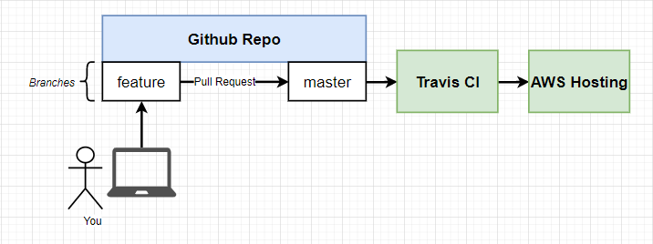
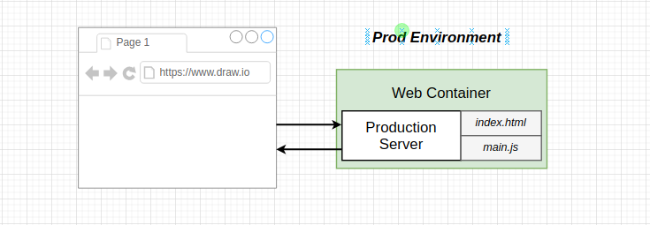
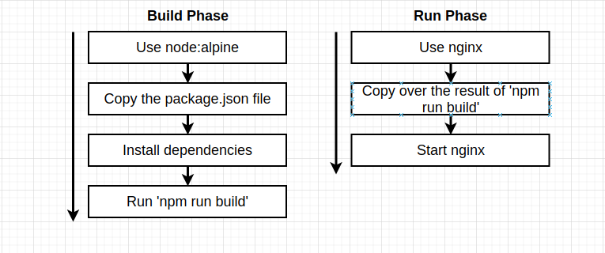

# Production Grade WF with GitHub, Docker, AWS and more.
The normal development flow is like `-> develop -> test -> deploy ->` which is a continuing circle. Our entire will be something like this:



Push and pull to feature branch, make a pull request to master branch, make Travis CI and run some tests; if tests are passing, then merge feature with amster and deploy it using AWS hosting service.

#### Source
All the files that are generated in this exercise is available [here](./exercices/production-grade-wf/).

Init a proj using `npx create-react-app frontend`, change to that proj and add `Dockerfile.dev` in the same directory (frontend)
```dockerfile
FROM node:alpine

WORKDIR /app
COPY package.json .
RUN npm install
# the below line is to fix some permission related issue.
RUN mkdir -p node_modules/.cache && chmod -R 777 node_modules/.cache
COPY . .

CMD ["npm", "start"]
```

`docker build -f Dockerfile.dev .`

But, the files so copied in container wont be updated as we update local files. So, we will be using Docker volumes. Volumes map a directory inside a container to a directory on the local machine.

```sh
docker run -p 3000:3000 -v app/node_modules -v $(pwd):/app image
```
- `-v $(pwd):/app` here we are mapping the current working directory of the local machine to /app directory in the container and
- using `-v app/node_modules` this notation, we are informing Docker to user the directory /app/node_modules which is present inside the container itself, without looking for a reference in the outside local machine.

---

The docker run commend we issues is weirdly long. So, let's use a shorthand with docker compose.

```yml
version: "3"
services:
  web:
    build:
      context: .
      dockerfile: Dockerfile.dev
    ports:
      - "3000:3000"
    volumes:
      - /app/node_modules
      - .:/app
  tests: # for running tests
    build:
      context: .
      dockerfile: Dockerfile.dev
    volumes:
      - /app/node_modules
      - .:/app
    command: ["npm", "run", "test"]
```
Now run `docker compose up --build` to create two services - one for the web app and other for testing purpose with both the containers sharing the local files via Docker volumes. 

One downside to this running test in a different container in docker compose is that we won't be able to interact with the shell and thus execute test commands. As an alternative to that, we can bring up a different container and run it with `it` so that we can have direct interaction to it's stdin/out/err streams.
```sh
docker run -it frontend_tests npm run test
```

## Multi-Step Docker Builds

Now we have a docker image for development environment. When moving to production, we do not need the bulky dev set up and the entire react frame work loaded in our server. So, the setup in prod env will be something like this:


Alright. But where did that 'index.html' and some js file come into picture? We will get those when we build the react app that we have developed.

Ok. And what about nginx? We will use nginx as our webserver which will serve users the web page we have developed(it will serve the html and js files; also any other files attached to the webpage). ngin is much more than a webserver - it can be used as a load balancer and reverse proxy (refer their doc for more at nginx.org).

So, we can do something like this:
```
Use node:alpine
👇
Copy the package.json file
👇
Install dependencies
👇
RUN 'npm run build'
👇
Start nginx
```

BUT, there are some issues with this approach:
```
Use node:alpine
👇
Copy the package.json file
👇
Install dependencies        # dependencies are only needed for 
                            # to execute 'npm run build'. For that, do we
                            # have to install 100+MB of dependencies
                            # on the prod container!
👇
RUN 'npm run build'
👇
Start nginx                 # where is nginx!?
```

Inorder to tackle these identified issues, we are going to run a mult-step build process as given below:



```dockerfile
FROM node:alpine AS builder
WORKDIR /app
COPY package.json .
RUN npm install
COPY . .
RUN npm run build

FROM nginx:alpine AS server
EXPOSE 80
COPY --from=builder /app/build /usr/share/nginx/html
# Checkout https://hub.docker.com/_/nginx to see where to put files to serve by nginx.
```

Now, run `docker build -t prodserver .` to create our production ready image and then `docker run -d -p 8080:80 prodserver` to start the container. ✌️


--- 
Github setup
TravisCI - travis-cli.com and authorize
Create travis yml file
```
Tell Travis we need a copy of docker running
👇
Build our image using Dockerfile.dev
👇
Tell Travis how to run our test suite
👇
Tell travis how to deploy our code to AWS
```

```yml
# .travis.yml
# Tell Travis we need a copy of docker running
sudo: required
services:
  - docker

# Tell Travis we need a copy of docker running
before_install:
  - docker build -t testimage -f Dockerfile.dev .

# Tell Travis how to run our test suite
script:
  - docker run testimage npm run test -- --converage

# Tell travis how to deploy our code to AWS
deploy:
  provider: elasticbeanstalk
  region: "us-east-1"
  app: "name of the app in aws beanstalk"
  env: "environment mentioned in beanstalk app"
  bucket_name: "bucket name"
  bucket_path: "app" # ideally a folder with name == app name
  on:
    branch: master

```
Now, create access key in aws using existing policies (as programmatic access from IAM > Add User) for beanstalk deployment. 

Make environment variables in Travis CI for the repo.
```
AWS_ACCESS_KEY      the access key
AWS_SECRET_KEY      the secret key
```
Now, add the same to travis yml:

```yml
sudo: required
services:
  - docker

before_install:
  - docker build -t testimage -f Dockerfile.dev .

script:
  - docker run testimage npm run test -- --converage

deploy:
  provider: elasticbeanstalk
  region: "us-east-1"
  app: "name of the app in aws beanstalk"
  env: "environment mentioned in beanstalk app"
  bucket_name: "bucket name"
  bucket_path: "app" # ideally a folder with name == app name
  on:
    branch: master
  access_key_id: $AWS_ACCESS_KEY
  secret_access_key:
    secure: $AWS_ACCESS_KEY 
```

Alright, now push the code to the github repo and ideally Travis should take the code, run tests and is tests passes, it will deploy the code in AWS beanstalk where it will use the Dockerfile and serves the production build of react app using nginx.

One more thing to add, if we commit to another branch, say `feature` branch and merge it to the master branch, it will also trigger a redeployment by Travis CI. ❤️